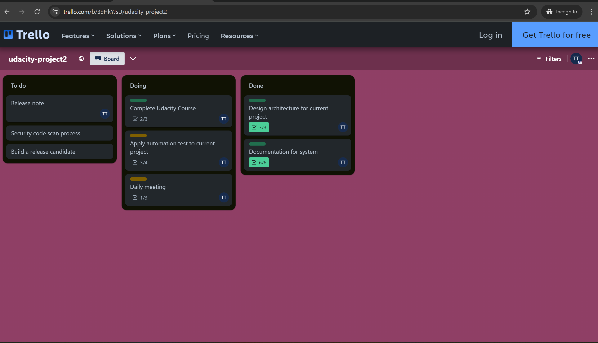
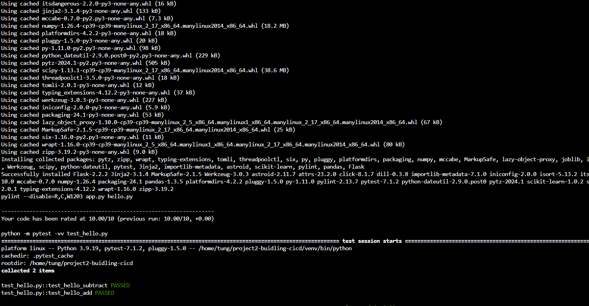

[](https://github.com/vnonline2008/project2-buidling-cicd/actions/workflows/python-app.yml)
# Overview

This project is showing how I can build CI/CD, integrate with Azure service such as Az Web app, Virtual Machine and Azure DevOps. Additional, I can create the scaffolding for my project and test my code

## Project Plan

* A link to a Trello board: [Trello board](https://trello.com/b/39HkYJsU/udacity-project2)

* The original plan: [Original project plan](./project-plan/original-plan.xlsx)
* The final plan: [Final project plan](./project-plan/final-plan.xlsx)

## Instructions

***Architecture for this project***  
  
  

### I. Clone and setup source code in Azure Cloud Shell
1. Check existing ssh key `ls -al ~/.ssh`
2. Generate ssh-key: `ssh-keygen -b 2048 -t rsa` *(move to step 4 if it's existing ssh key)*  

3. Add key-gen to ssh agent: `ssh-add ~/.ssh/id_rsa`  

4. Retrieve publish key-gen: `cat ~/.ssh/id_rsa.pub`  

5. Copy key-gen above, go to Github account setting -> SSH and GPG keys > New SSH key, then, paste key-gen here
6. Use `git clone` command to clone project  

7. Create virtual environment: `python3 -m venv project/venv`
8. Activate virtual environment: `source project/venv/bin/activate`
9. Change directory and use **Makefile** to install dependencies, lint and test by 2 these commands `cd project` and `make all`



### II. Create web app and deploy (Use Azure CLI to create web app)
1. Create a variables.sh file that will be used to export environment variable, then, use this command to execute `source variables.sh`
```
export RESOURCE_GROUP='Your resource group'
export LOCATION='location'
export RUN_TIME='run time version'
export ADMIN_USERNAME='vm username'
export ADMIN_PASSWORD='vm password'
```
1. Create a resource group `az group create --name $RESOURCE_GROUP --location $LOCATION`
2. Create and deploy a web app, app service plan `az webapp up --name <we-app-name> -resource-group $RESOURCE_GROUP --location $LOCATION --runtime $RUN_TIME --sku B1`  
  
  
3. Run make predict file to test web app  
  

### III. Setup GitHub workflow to trigger run CI whenever code changes
1. Go to  GitHub repository -> Actions -> New workflow -> In Continuous Integration, select **Python application**
2. Change script for each step to run by make command
3. Finally, commit and push code changes, the workflow should be triggered  


### IV. Configure self-host agent and azure pipeline
1. Create a virtual machine to consider as self-host agent `az vm create -n <vm-name> -g $RESOURCE_GROUP --image Ubuntu2204 -l $LOCATION --admin-username $ADMIN_USERNAME --admin-password $ADMIN_PASSWORD`
2. Go to portal -> get VM's IP -> ssh to VM and configure (following the attached link below)
3. Install docker and add user
```
sudo snap install docker
sudo apt update
sudo groupadd docker
sudo usermod -aG docker $USER
```
4. After run command to install docker and add user -> exit -> restart VM to apply changes
5. Install and setup agent machine, then, run command below to prepare agent for building the Flask app
```
sudo apt-get update
sudo apt update
sudo apt install software-properties-common
sudo add-apt-repository ppa:deadsnakes/ppa
```
6. Check python version. Install new version if the current version doesn't match expectation (In my case, I have to install python version 3.9 to satisfy dependencies)
```
sudo apt install python3.9
sudo apt-get install python3.9-venv
sudo apt-get install python3-pip
sudo apt-get install python3.9-distutils
sudo apt-get -y install zip
python3.9 --version
pip --version
zip -v
```
7. Install pylint and setup PATH
```
pip install pylint==2.13.7
pip show --files pylint
echo $PATH
export PATH=$HOME/.local/bin:$PATH
echo $PATH
which pylint
```
8. Everything is ready right now. Let try to commit and push code changes, then, the azure pipeline will be triggered  


> **Note**: Please refer this link to get more details  
[**Configure self-host agent for Linx**](https://learn.microsoft.com/en-us/azure/devops/pipelines/agents/linux-agent?view=azure-devops)  
[**Configure new azure pipeline to build and deploy**](https://learn.microsoft.com/en-us/azure/devops/pipelines/ecosystems/python-webapp?view=azure-devops&tabs=linux)  

9. After, azure pipeline completed, then, deploy artifact to web app, we can run **locust** at local for testing purposes. (By default, the locust will use port **8089**, then, access to this URL ***http://localhost:8089*** and look at the result)  


10. Finally, use this command to check stream log of web app `az webapp log tail`  
  

> **Note**: After finished everything, remember run this command to delete all services in-use `az group delete --name $RESOURCE_GROUP --location $LOCATION`
## Enhancements
- We should upgrade python version and dependencies in **requirements.txt** file. All packages version that are installed, should be added in **requirements.txt**, use this command `pip freeze > requirements.txt`
- The project should have a good structure
- To ensure a stable build version, docker should be used to containerize library, source code...etc
- Apply **kubernetes (k8s)** If we want to implement microservices

## Demo 

[**Link demo on Youtube**](https://youtu.be/P6-0bNwC4-8)


